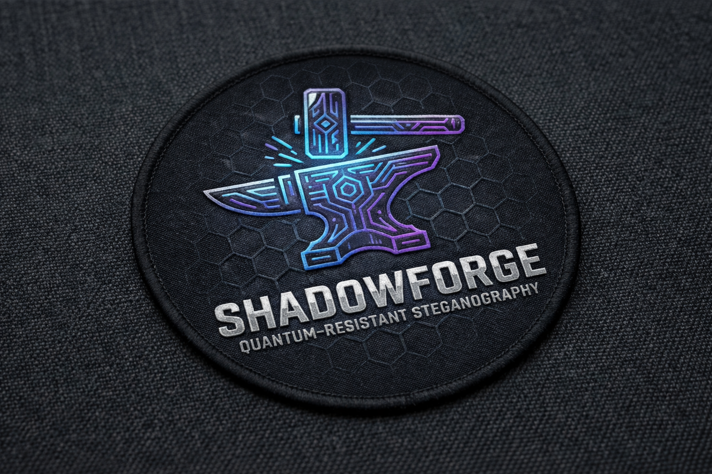

# shadowforge-rs



> *"Forge secrets in the shadows, shield them from quantum eyes — and from the eyes of states."*

[](https://releases.rs/docs/1.94.1/)
[](https://doc.rust-lang.org/edition-guide/rust-2024/)
[](LICENSE)
[](https://github.com/greysquirr3l/shadowforge-rs/actions)
[](https://github.com/greysquirr3l/shadowforge-rs/actions)
[](coverage/tarpaulin-report.html)
[](SECURITY.md)

**shadowforge-rs** is a quantum-resistant steganography toolkit for
**journalists, whistleblowers, and dissidents** operating against
nation-state adversaries.

It is a Rust reimplementation of
[shadowforge (Go)](https://github.com/greysquirr3l/shadowforge), with
PDF as a first-class citizen and a full suite of countermeasures designed
specifically for the journalist-vs-nation-state threat model.

---

## ⚠️ Pre-Production Warning

This software has **not been externally security audited**. Use it as a
supplementary layer alongside established tools (Signal, Tor, SecureDrop).
See [SECURITY.md](SECURITY.md) and [THREAT_MODEL.md](THREAT_MODEL.md).

---

## Feature Matrix

| Feature | Go version | Rust version |
|---------|-----------|--------------|
| LSB image steganography | ✅ | ✅ |
| DCT JPEG steganography | ✅ | ✅ |
| Palette steganography | ✅ | ✅ |
| LSB audio (WAV) | ✅ | ✅ |
| Phase encoding (DSSS) | ✅ | ✅ |
| Echo hiding | ✅ | ✅ |
| Zero-width text | ✅ | ✅ (grapheme-cluster-safe) |
| PDF embedding | ⚠️ afterthought | ✅ first-class |
| PDF content-stream LSB | ❌ | ✅ |
| PDF XMP metadata embedding | ❌ | ✅ |
| PDF shard-per-page pipeline | ❌ | ✅ |
| ML-KEM-1024 (NIST FIPS 203) | via CIRCL (CGo) | ✅ pure Rust |
| ML-DSA-87 (NIST FIPS 204) | via CIRCL (CGo) | ✅ pure Rust |
| Reed-Solomon K-of-N | ✅ | ✅ |
| 4 distribution patterns | ✅ | ✅ |
| **Adversarial embedding optimisation** | ❌ | ✅ |
| **Camera model fingerprint matching** | ❌ | ✅ |
| **Compression-survivable embedding** | ❌ | ✅ |
| **Deniable dual-payload steganography** | ❌ | ✅ |
| **Panic wipe** | ❌ | ✅ |
| **Dead drop mode** | ❌ | ✅ |
| **Canary shard tripwires** | ❌ | ✅ |
| **Time-lock puzzle payloads** | ❌ | ✅ |
| **Stylometric fingerprint scrubbing** | ❌ | ✅ |
| **Corpus steganography (zero-modification)** | ❌ | ✅ |
| **Amnesiac mode (zero disk writes)** | ❌ | ✅ |
| **Geographic threshold distribution** | ❌ | ✅ |
| **Forensic watermark tripwires** | ❌ | ✅ |

---

## Quick Start

### Installation

```bash
# From source (requires Rust 1.94.1)
git clone https://github.com/greysquirr3l/shadowforge-rs
cd shadowforge-rs
make release
sudo install target/release/shadowforge /usr/local/bin/
```

### PDF Support (Optional)

PDF page rasterisation requires the pdfium shared library. Without it,
PDF content-stream and metadata steganography still work, but the
render-to-PNG pipeline is unavailable.

```bash
# macOS (Apple Silicon)
curl -L https://github.com/bblanchon/pdfium-binaries/releases/latest/download/pdfium-mac-arm64.tgz | tar xz
export PDFIUM_DYNAMIC_LIB_PATH="$(pwd)/lib"

# macOS (Intel)
curl -L https://github.com/bblanchon/pdfium-binaries/releases/latest/download/pdfium-mac-x64.tgz | tar xz
export PDFIUM_DYNAMIC_LIB_PATH="$(pwd)/lib"

# Linux (x86_64)
curl -L https://github.com/bblanchon/pdfium-binaries/releases/latest/download/pdfium-linux-x64.tgz | tar xz
export PDFIUM_DYNAMIC_LIB_PATH="$(pwd)/lib"
```

To persist the environment variable, add the `export` line to your shell
profile (`~/.bashrc`, `~/.zshrc`, etc.).

### Shell Completions

```bash
# Generate completions for your shell
shadowforge completions bash > ~/.local/share/bash-completion/completions/shadowforge
shadowforge completions zsh > ~/.zfunc/_shadowforge
shadowforge completions fish > ~/.config/fish/completions/shadowforge.fish
```

### Basic Usage

```bash
# Generate a key pair
shadowforge keygen --algorithm kyber1024 --output ~/keys/

# Embed a payload in an image (adaptive mode — defeats commodity steganalysis)
shadowforge embed \
    --input secret.txt \
    --cover photo.jpg \
    --output stego.jpg \
    --key ~/keys/public.key \
    --technique lsb \
    --profile adaptive

# Extract
shadowforge extract \
    --input stego.jpg \
    --key ~/keys/secret.key \
    --output recovered.txt \
    --technique lsb

# Deniable embedding (two payloads, one cover, plausible deniability)
shadowforge embed \
    --input real_document.txt \
    --cover photo.jpg \
    --output stego.jpg \
    --key ~/keys/public.key \
    --deniable \
    --decoy-payload innocent.txt \
    --decoy-key ~/keys/decoy_public.key

# Analyse detectability before embedding
shadowforge analyze detectability --cover photo.jpg --technique lsb

# Dead drop: encode for Instagram (survives platform recompression)
shadowforge dead-drop encode \
    --cover photo.jpg \
    --input secret.txt \
    --platform instagram \
    --key ~/keys/public.key \
    --output upload_ready.jpg \
    --manifest-output retrieval.json

# Scrub stylometric fingerprints from a text payload
shadowforge scrub --input my_document.txt --output scrubbed.txt

# Distribute across multiple covers with geographic manifest
shadowforge embed-distributed \
    --input document.txt \
    --covers contact_photos/*.jpg \
    --data-shards 3 \
    --parity-shards 2 \
    --output-archive shards.zip \
    --key ~/keys/public.key \
    --canary \
    --geo-manifest geo.toml

# Zero-trace mode (no disk writes)
shadowforge embed --amnesia \
    --input payload.txt \
    --cover cover.jpg \
    --key public.key > output.jpg
```

---

## Architecture

**Cargo workspace mono-repo** — all crates live under `crates/`. The main
crate is `crates/shadowforge`, organised as **Collapsed Hexagonal / DDD-lite**
with four layers: `domain/` (pure, no I/O), `adapters/` (I/O and FFI),
`application/` (thin orchestration), `interface/` (CLI).

Seventeen bounded contexts live under `domain/`, sharing a single canonical
type vocabulary (`domain/types.rs`). Nothing is re-invented per context.

Future crates (`shadowforge-web`, `shadowforge-api`, etc.) add as new members
under `crates/` — no restructuring required.

See the full [architecture documentation](https://greysquirr3l.github.io/shadowforge-rs/architecture/design.html)
for design rationale and bounded context details.

---

## Threat Model

See [THREAT_MODEL.md](THREAT_MODEL.md) for the full threat model.

**Adversary**: Nation-state. Automated mass steganalysis, compelled
decryption, traffic analysis, endpoint compromise, jurisdictional legal
pressure, stylometric source identification.

---

## Operational Security

Operational playbooks with step-by-step procedures for five common
journalist scenarios are available in the source repository (clone to
access). They cover border crossings, dead drops, geographic distribution,
time-lock source protection, and zero-trace operation.

See `docs/src/opsec/` after cloning.

---

## Documentation

Full documentation is published at
**[greysquirr3l.github.io/shadowforge-rs](https://greysquirr3l.github.io/shadowforge-rs/)**
— covering CLI reference, threat model, architecture, and contributing
guidelines.

---

## Development

```bash
make build      # cargo build
make test       # cargo test
make lint       # cargo clippy -D warnings
make check      # fmt + lint + test + deny
make coverage   # cargo tarpaulin (requires install)
make deny       # cargo deny check
make completions # generate shell completions
make book       # build mdbook site locally
make doc        # build rustdoc API docs
```

### Test Coverage

380 tests across all adapter, domain, and application modules — **85% line
coverage** (2039/2397 lines). Key module coverage:

| Module | Coverage |
|--------|----------|
| `application/services` | 100% |
| `domain/types` | 100% |
| `domain/analysis` | 98.6% |
| `domain/crypto` | 93.5% |
| `domain/distribution` | 89.2% |
| `adapters/opsec` | 88% |
| `adapters/media` | 86.4% |
| `adapters/archive` | 86% |
| `adapters/stego` | 84.5% |

Coverage is enforced via `cargo-tarpaulin` with an 85% overall threshold
and a 90% threshold for `domain::crypto`.

See the [contributing guide](https://greysquirr3l.github.io/shadowforge-rs/contributing/setup.html)
for full development setup instructions.

---

## License

Apache License 2.0 — see [LICENSE](LICENSE).

---

## Acknowledgements

Built on the shoulders of:
[ml-kem](https://crates.io/crates/ml-kem),
[ml-dsa](https://crates.io/crates/ml-dsa),
[reed-solomon-erasure](https://crates.io/crates/reed-solomon-erasure),
[lopdf](https://crates.io/crates/lopdf),
[pdfium-render](https://crates.io/crates/pdfium-render),
[unicode-segmentation](https://crates.io/crates/unicode-segmentation),
[zeroize](https://crates.io/crates/zeroize),
[subtle](https://crates.io/crates/subtle).

*Go version*: [greysquirr3l/shadowforge](https://github.com/greysquirr3l/shadowforge)
